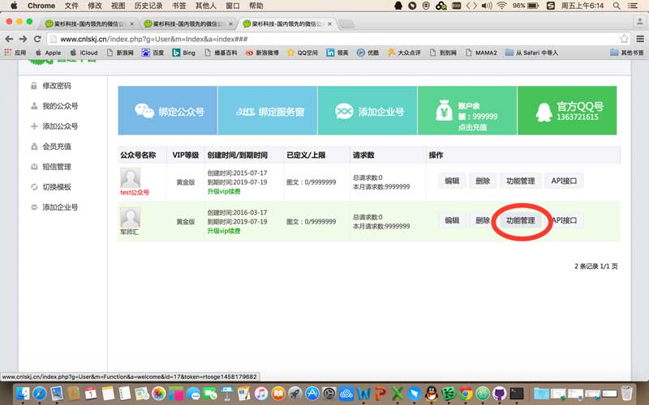
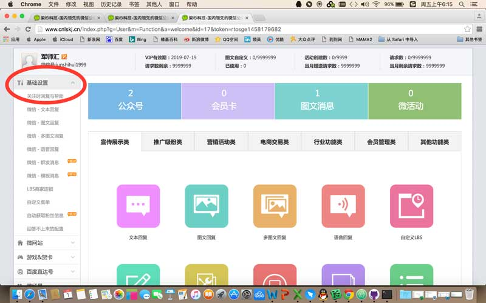
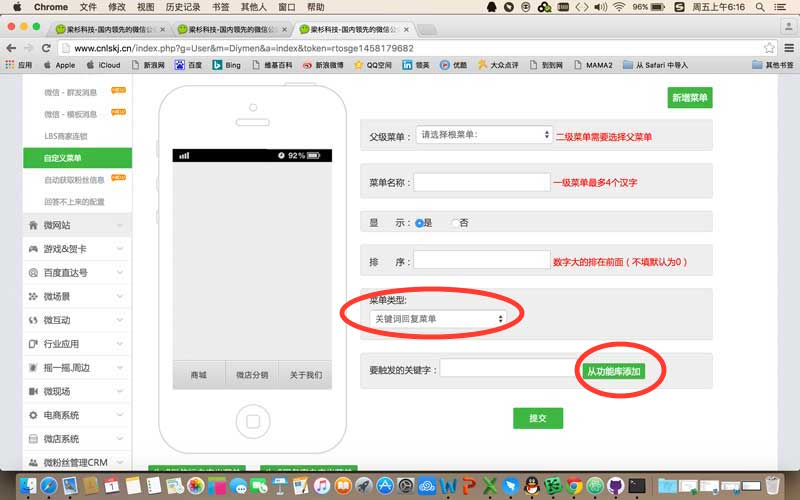
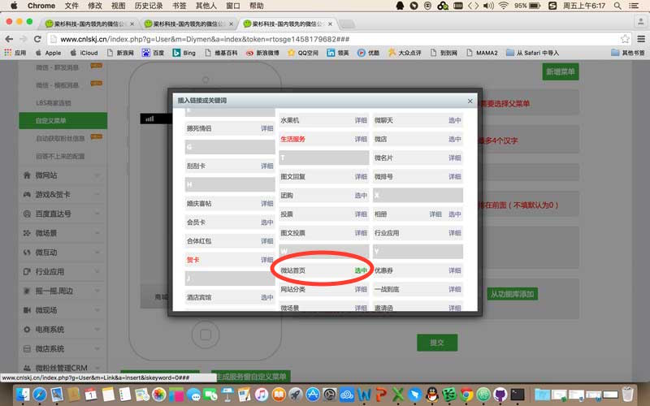

### 三、”军师汇“微网站配置
#### 1. 点击对应公众号的”功能管理“进入后台。

#### 2. 点击"基础配置"，进行逐项配置

#### 3. 其中重要的是自定义菜单-》菜单类型-》url链接菜单

#### 4. “要链接到的URL地址：” 项，点选右侧 "从功能库添加"，点选弹出页面选项-》"微站首页"（参考截图）

#### 5. 点击微网站下拉菜单配置

#### 6. 暂时使用“模板管理”， “高级模板”是另外的一套系统有待测试。
