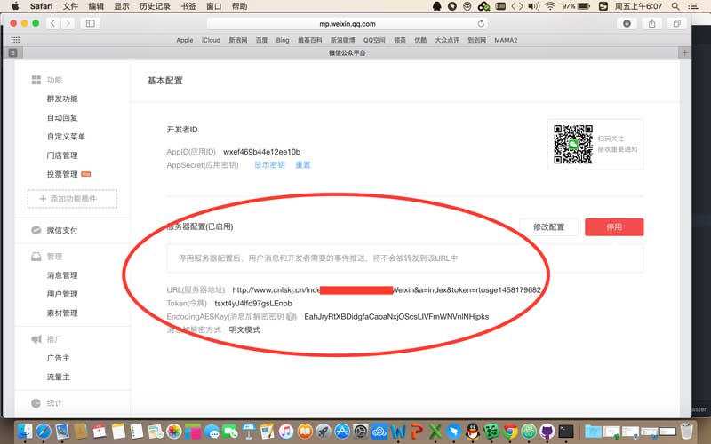

### 二、配置公众号和返回微信公众平台后台配置
#### 1. 登录后台

#### 2. 添加公众号信息

> 注意原始ID容易填错，切记！

#### 3. Api信息获取

> 弹出部分的信息，前三个最重要都是要填入微信公众平台后台的信息，后面将会说到。

#### 4. 返回微信公众号平台，配置Api信息(URL、Token、EncodingAESKey参考截图)，网页服务->网页账号->“www.cnlskj.cn”接口地址配置
##### 1) 进入微信后台mp.weixin.qq.com
##### 2）【开发】-》【基本配置】，修改服务器配置。
##### 3) 填写上一步”步骤3”中获取的弹出URL、Token、EncondingAESKey信息。

##### 4) 修改服务器配置后点击“启用”按钮。
##### 5）【开发】-》【接口权限】-》【网页服务】-》【网页账号】右侧的“修改”按钮，填入”www.cnlskj.cn"地址，参考下图。

#### 5. 测试是否成功方法，参考下一步”三、“军师汇”微网站配置”，进入后台后，”基础设置”-》“关注时回复与帮助”-》设置一条测试信息，用微信关注测试
